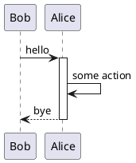
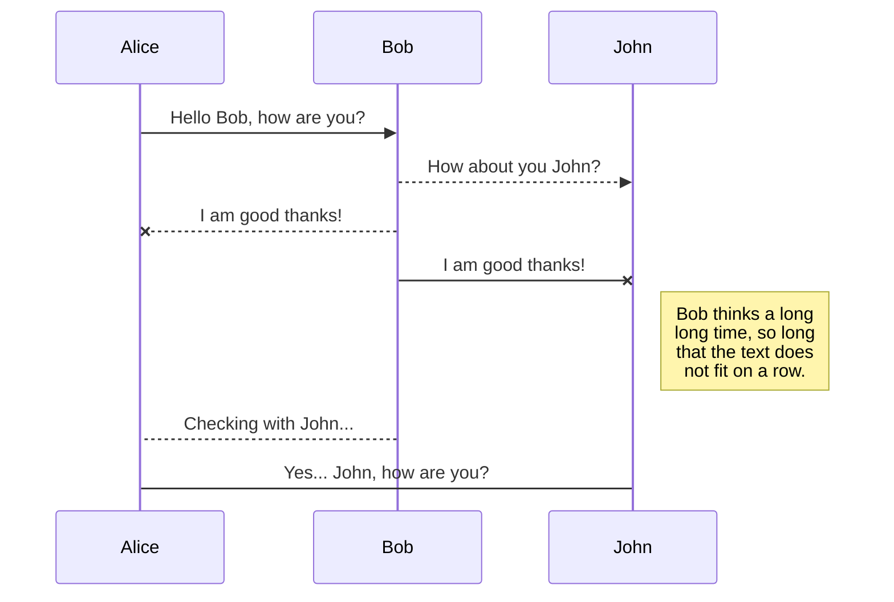

Outputting to stdout...
Outputting to stdout...
Outputting to stdout...
Skipped 0 files ignored in '.gitignore'
ResolvedPath---/home/astrid/git/javascript/embed/embedme/test/fixtures/fixture-source.md
LineNumber: 5
Embedded 2 linesundefined from file snippets/sample.txt
----------------------
```txt
// snippets/sample.txt

This file is unformatted plain text

```
LineNumber: 11
Embedded 2 linesundefined from file snippets/sample.re
----------------------
```re
// snippets/sample.re

let hello = () : string => "Hello, World!";

```
LineNumber: 17
Embedded 4 linesundefined from file snippets/sample.ts
----------------------
```ts
// snippets/sample.ts

export function hello(): string {
  return 'Hello World';
}

```
LineNumber: 23
Embedded 2 linesundefined from file snippets/sample.js
----------------------
```js
// snippets/sample.js

console.log('Hello World');

```
LineNumber: 29
Embedded 2 linesundefined from file snippets/sample.html
----------------------
```html
<!-- snippets/sample.html -->

<h1>Hello world</h1>

```
LineNumber: 35
Embedded 2 linesundefined from file snippets/sample.py
----------------------
```py
# snippets/sample.py

print('Hello World')

```
LineNumber: 41
Embedded 4 linesundefined from file snippets/sample.rs
----------------------
```rust
// snippets/sample.rs

fn main() {
    println!("Hello World!");
}

```
LineNumber: 48
Embedded 9 linesundefined from file snippets/sample.cpp
----------------------
```cpp
// snippets/sample.cpp

#include <iostream>
using namespace std;

int main()
{
    cout << "Hello, World!";
    return 0;
}

```
LineNumber: 54
Embedded 9 linesundefined from file snippets/sample.ino
----------------------
```cpp
// snippets/sample.ino

#include <iostream>
using namespace std;

int main()
{
    cout << "Hello, World!";
    return 0;
}

```
LineNumber: 60
Embedded 8 linesundefined from file snippets/sample.c
----------------------
```c
// snippets/sample.c

#include <stdio.h>
int main()
{
   // printf() displays the string inside quotation
   printf("Hello, World!");
   return 0;
}

```
LineNumber: 66
Embedded 9 linesundefined from file snippets/sample.java
----------------------
```java
// snippets/sample.java

public class HelloWorld {

    public static void main(String[] args) {
        // Prints "Hello, World" to the terminal window.
        System.out.println("Hello, World");
    }

}

```
LineNumber: 72
Embedded 8 linesundefined from file snippets/sample.go
----------------------
```go
// snippets/sample.go

package main

import "fmt"

func main() {
    fmt.Println("hello world")
}

```
LineNumber: 78
Embedded 3 linesundefined from file snippets/sample.sh
----------------------
```sh
# snippets/sample.sh

#!/usr/bin/env bash
print Hello World

```
LineNumber: 84
Embedded 3 linesundefined from file snippets/sample.sh
----------------------
```sh
# snippets/sample.sh

#!/usr/bin/env bash
print Hello World

```
LineNumber: 90
Embedded 9 linesundefined from file snippets/sample.m
----------------------
```objectivec
// snippets/sample.m

#import <Foundation/Foundation.h>

int main(int argc, const char * argv[]) {
    @autoreleasepool {
        NSLog(@"Hello, World!");
    }
    return 0;
}

```
LineNumber: 96
Embedded 6 linesundefined from file snippets/sample.scss
----------------------
```scss
// snippets/sample.scss

.hello {
  .world {
    border: 1px solid red;
  }
}

```
LineNumber: 102
Embedded 4 linesundefined from file snippets/sample.php
----------------------
```php
// snippets/sample.php

<?php
	echo 'Hello, World!';
?>

```
LineNumber: 108
Embedded 16 linesundefined from file snippets/sample.cs
----------------------
```cs
// snippets/sample.cs

using System;
namespace HelloWorld
{
    class Hello
    {
        static void Main()
        {
            Console.WriteLine("Hello World!");

            // Keep the console window open in debug mode.
            Console.WriteLine("Press any key to exit.");
            Console.ReadKey();
        }
    }
}

```
LineNumber: 114
Embedded 2 linesundefined from file snippets/sample.swift
----------------------
```swift
// snippets/sample.swift

print("Hello, world!")

```
LineNumber: 120
Embedded 4 linesundefined from file snippets/sample.xml
----------------------
```xml
<!-- snippets/sample.xml -->

<hello>
    <world>true</world>
</hello>

```
LineNumber: 126
Embedded 3 linesundefined from file snippets/sample.yaml
----------------------
```yaml
# snippets/sample.yaml

hello:
  - world

```
LineNumber: 134
Embedded 4 linesundefined from file snippets/sample.json
----------------------
```json
{
  "hello": "world"
}

```
LineNumber: 140
Embedded 4 linesundefined from file snippets/sample.json5
----------------------
```json5
// snippets/sample.json5

{
  hello: 'world',
}

```
LineNumber: 146
Embedded 2 linesundefined from file snippets/sample.rb
----------------------
```rb
# snippets/sample.rb

puts 'Hello, world!'

```
LineNumber: 152
Embedded 2 linesundefined from file snippets/sample.cr
----------------------
```cr
# snippets/sample.cr

puts 'Hello, world!'

```
LineNumber: 158
Embedded 4 linesundefined from file snippets/sample.kt
----------------------
```kotlin
// snippets/sample.kt

fun main(args: Array<String>) {
    println("Hello World!")
}

```
LineNumber: 164
Embedded 6 linesundefined from file snippets/sample.scala
----------------------
```scala
// snippets/sample.scala

object HelloWorld {
  def main(args: Array[String]): Unit = {
    println("Hello, world!")
  }
}

```
LineNumber: 170
Embedded 7 linesundefined from file snippets/sample.puml
----------------------

LineNumber: 176
Embedded 10 linesundefined from file snippets/sample.mermaid
----------------------

LineNumber: 182
Embedded 10 linesundefined from file snippets/sample.proto
----------------------
```proto
// snippets/sample.proto

syntax = "proto3";

enum Places {
    WORLD = 0;
}

message Hello {
    Places place = 1;
}

```
LineNumber: 188
Embedded 4 linesundefined from file snippets/sample.cmake
----------------------
```cmake
# snippets/sample.cmake

cmake_minimum_required(VERSION 2.8.9)
project (hello)
add_executable(hello sample.cpp)

```
LineNumber: 194
Embedded 3 linesundefined from file snippets/sample.sql
----------------------
```sql
-- snippets/sample.sql

SELECT * 
FROM tableUsers
WHERE 1=1
```
LineNumber: 200
Embedded 2 linesundefined from file snippets/sample.hs
----------------------
```hs
-- snippets/sample.hs

main = putStrLn "Hello, world!"

```
LineNumber: 206
Embedded 2 linesundefined from file snippets/sample.jsx
----------------------
```jsx
// snippets/sample.jsx

console.log('Hello World');

```
LineNumber: 212
Embedded 4 linesundefined from file snippets/sample.tsx
----------------------
```tsx
// snippets/sample.tsx

export function hello(): string {
  return 'Hello World';
}

```
LineNumber: 218
Embedded 3 linesundefined from file snippets/sample
----------------------
```sh
# snippets/sample

#!/usr/bin/env bash
print Hello World

```
LineNumber: 224
Embedded 8 linesundefined from file snippets/sample.cs#L6-L13
----------------------
```cs
// snippets/sample.cs#L6-L13

static void Main()
{
    Console.WriteLine("Hello World!");

    // Keep the console window open in debug mode.
    Console.WriteLine("Press any key to exit.");
    Console.ReadKey();
}
```
LineNumber: 230
Embedded 4 linesundefined from file snippets/sample.ts
----------------------
    ```ts
    // snippets/sample.ts
    
    export function hello(): string {
      return 'Hello World';
    }
    
    ```
LineNumber: 238
"Ignore next" comment detected, skipping code block...
----------------------
```ts
// snippets/sample.ts
```
LineNumber: 246
"Ignore next" comment detected, skipping code block...
----------------------
```ts
// snippets/sample.ts
```
LineNumber: 254
Embedded 4 linesundefined from file snippets/sample.ts
----------------------
```ts
export function hello(): string {
  return 'Hello World';
}

```
LineNumber: 261
Embedded 4 linesundefined from file snippets/sample.json
----------------------
```{.json caption="Some JSON file"}
{
  "hello": "world"
}

```
LineNumber: 269
Code block is empty & no preceding embedme comment, skipping...
----------------------
```ts
```
LineNumber: 274
Unsupported file extension [binary], supported extensions are txt, ts, js, re, scss, rust, java, cpp, c, html, xml, md, yaml, json, json5, py, bash, sh, go, objectivec, php, cs, swift, rb, kotlin, scala, cr, puml, mermaid, cmake, proto, sql, hs, ino, jsx, tsx, skipping code block
----------------------
```binary
01001000 01100101 01101100 01101100 01101111 00100000 01010111 01101111 01110010 01101100 01100100
```
LineNumber: 280
No code extension detected, skipping code block...
----------------------
```
Ignored block
```
LineNumber: 286
No comment detected in first line for block with extension ts
----------------------
```ts
// Not a file
```
LineNumber: 292
Found filename also-not-a-file in comment in first line, but file does not exist at /home/astrid/git/javascript/embed/embedme/test/fixtures/also-not-a-file!
----------------------
```ts
// also-not-a-file
```
LineNumber: 298
Found filename this-file-does-not-exist.txt in comment in first line, but file does not exist at /home/astrid/git/javascript/embed/embedme/test/fixtures/this-file-does-not-exist.txt!
----------------------
```txt
// this-file-does-not-exist.txt
```
LineNumber: 304
Found filename contains-codefence.md in comment in first line, but file does not exist at /home/astrid/git/javascript/embed/embedme/test/fixtures/contains-codefence.md!
----------------------
```md
<!-- contains-codefence.md -->
```
LineNumber: 310
Found filename contains-codefence.md in comment in first line, but file does not exist at /home/astrid/git/javascript/embed/embedme/test/fixtures/contains-codefence.md!
----------------------
```md
<!-- contains-codefence.md#L1-L3 -->

# This markdown document

## Contains a codefence
```
LineNumber: 320
Incorrectly formatted line numbering string snippets/sample.ts#L1-2, Expecting Github formatting e.g. #L10-L20
----------------------
```ts
// snippets/sample.ts#L1-2
```
LineNumber: 326
Code block is empty & no preceding embedme comment, skipping...
----------------------
```json

```
# File types

Plain Text

```txt
// snippets/sample.txt

This file is unformatted plain text

```

Reason

```re
// snippets/sample.re

let hello = () : string => "Hello, World!";

```

Typescript

```ts
// snippets/sample.ts

export function hello(): string {
  return 'Hello World';
}

```

Javascript

```js
// snippets/sample.js

console.log('Hello World');

```

HTML

```html
<!-- snippets/sample.html -->

<h1>Hello world</h1>

```

Python

```py
# snippets/sample.py

print('Hello World')

```

Rust

```rust
// snippets/sample.rs

fn main() {
    println!("Hello World!");
}

```

C++

```cpp
// snippets/sample.cpp

#include <iostream>
using namespace std;

int main()
{
    cout << "Hello, World!";
    return 0;
}

```

Arduino

```cpp
// snippets/sample.ino

#include <iostream>
using namespace std;

int main()
{
    cout << "Hello, World!";
    return 0;
}

```

C

```c
// snippets/sample.c

#include <stdio.h>
int main()
{
   // printf() displays the string inside quotation
   printf("Hello, World!");
   return 0;
}

```

Java

```java
// snippets/sample.java

public class HelloWorld {

    public static void main(String[] args) {
        // Prints "Hello, World" to the terminal window.
        System.out.println("Hello, World");
    }

}

```

Golang

```go
// snippets/sample.go

package main

import "fmt"

func main() {
    fmt.Println("hello world")
}

```

Bash

```sh
# snippets/sample.sh

#!/usr/bin/env bash
print Hello World

```

Shell

```sh
# snippets/sample.sh

#!/usr/bin/env bash
print Hello World

```

Objective C

```objectivec
// snippets/sample.m

#import <Foundation/Foundation.h>

int main(int argc, const char * argv[]) {
    @autoreleasepool {
        NSLog(@"Hello, World!");
    }
    return 0;
}

```

SCSS

```scss
// snippets/sample.scss

.hello {
  .world {
    border: 1px solid red;
  }
}

```

PHP

```php
// snippets/sample.php

<?php
	echo 'Hello, World!';
?>

```

C#

```cs
// snippets/sample.cs

using System;
namespace HelloWorld
{
    class Hello
    {
        static void Main()
        {
            Console.WriteLine("Hello World!");

            // Keep the console window open in debug mode.
            Console.WriteLine("Press any key to exit.");
            Console.ReadKey();
        }
    }
}

```

Swift

```swift
// snippets/sample.swift

print("Hello, world!")

```

XML

```xml
<!-- snippets/sample.xml -->

<hello>
    <world>true</world>
</hello>

```

Yaml

```yaml
# snippets/sample.yaml

hello:
  - world

```

JSON

<!-- embedme snippets/sample.json -->

```json
{
  "hello": "world"
}

```

JSON5

```json5
// snippets/sample.json5

{
  hello: 'world',
}

```

Ruby

```rb
# snippets/sample.rb

puts 'Hello, world!'

```

Crystal

```cr
# snippets/sample.cr

puts 'Hello, world!'

```

Kotlin

```kotlin
// snippets/sample.kt

fun main(args: Array<String>) {
    println("Hello World!")
}

```

Scala

```scala
// snippets/sample.scala

object HelloWorld {
  def main(args: Array[String]): Unit = {
    println("Hello, world!")
  }
}

```

Plant UML


Mermaid


Protobuf

```proto
// snippets/sample.proto

syntax = "proto3";

enum Places {
    WORLD = 0;
}

message Hello {
    Places place = 1;
}

```

CMake

```cmake
# snippets/sample.cmake

cmake_minimum_required(VERSION 2.8.9)
project (hello)
add_executable(hello sample.cpp)

```

SQL Script

```sql
-- snippets/sample.sql

SELECT * 
FROM tableUsers
WHERE 1=1
```

Haskell

```hs
-- snippets/sample.hs

main = putStrLn "Hello, world!"

```

JSX

```jsx
// snippets/sample.jsx

console.log('Hello World');

```

TSX

```tsx
// snippets/sample.tsx

export function hello(): string {
  return 'Hello World';
}

```

## Extension-less selection

```sh
# snippets/sample

#!/usr/bin/env bash
print Hello World

```

## Line selection

```cs
// snippets/sample.cs#L6-L13

static void Main()
{
    Console.WriteLine("Hello World!");

    // Keep the console window open in debug mode.
    Console.WriteLine("Press any key to exit.");
    Console.ReadKey();
}
```

## Indented selection

    ```ts
    // snippets/sample.ts
    
    export function hello(): string {
      return 'Hello World';
    }
    
    ```

## Embedme Ignore

<!-- embedme-ignore-next -->

```ts
// snippets/sample.ts
```

## Embedme Ignore alt syntax

<!-- embedme ignore-next -->

```ts
// snippets/sample.ts
```

## Embed with comment

<!-- embedme snippets/sample.ts -->

```ts
export function hello(): string {
  return 'Hello World';
}

```

### Embed with comment and unknown file type

<!-- embedme snippets/sample.json -->

```{.json caption="Some JSON file"}
{
  "hello": "world"
}

```

## Errors

### Empty block

```ts
```

### No file handler

```binary
01001000 01100101 01101100 01101100 01101111 00100000 01010111 01101111 01110010 01101100 01100100
```

### No file extension

```
Ignored block
```

### Bad file format

```ts
// Not a file
```

### Also bad file format

```ts
// also-not-a-file
```

### Missing file

```txt
// this-file-does-not-exist.txt
```

### Contains Codefence

```md
<!-- contains-codefence.md -->
```

### Contains Codefence, but not the embedded lines

```md
<!-- contains-codefence.md#L1-L3 -->

# This markdown document

## Contains a codefence
```

### malformed line numbering

```ts
// snippets/sample.ts#L1-2
```

### missing comment on language embed with no comment support

```json

```

# File types

Plain Text

```txt
// snippets/sample.txt

This file is unformatted plain text

```

Reason

```re
// snippets/sample.re

let hello = () : string => "Hello, World!";

```

Typescript

```ts
// snippets/sample.ts

export function hello(): string {
  return 'Hello World';
}

```

Javascript

```js
// snippets/sample.js

console.log('Hello World');

```

HTML

```html
<!-- snippets/sample.html -->

<h1>Hello world</h1>

```

Python

```py
# snippets/sample.py

print('Hello World')

```

Rust

```rust
// snippets/sample.rs

fn main() {
    println!("Hello World!");
}

```

C++

```cpp
// snippets/sample.cpp

#include <iostream>
using namespace std;

int main()
{
    cout << "Hello, World!";
    return 0;
}

```

Arduino

```cpp
// snippets/sample.ino

#include <iostream>
using namespace std;

int main()
{
    cout << "Hello, World!";
    return 0;
}

```

C

```c
// snippets/sample.c

#include <stdio.h>
int main()
{
   // printf() displays the string inside quotation
   printf("Hello, World!");
   return 0;
}

```

Java

```java
// snippets/sample.java

public class HelloWorld {

    public static void main(String[] args) {
        // Prints "Hello, World" to the terminal window.
        System.out.println("Hello, World");
    }

}

```

Golang

```go
// snippets/sample.go

package main

import "fmt"

func main() {
    fmt.Println("hello world")
}

```

Bash

```sh
# snippets/sample.sh

#!/usr/bin/env bash
print Hello World

```

Shell

```sh
# snippets/sample.sh

#!/usr/bin/env bash
print Hello World

```

Objective C

```objectivec
// snippets/sample.m

#import <Foundation/Foundation.h>

int main(int argc, const char * argv[]) {
    @autoreleasepool {
        NSLog(@"Hello, World!");
    }
    return 0;
}

```

SCSS

```scss
// snippets/sample.scss

.hello {
  .world {
    border: 1px solid red;
  }
}

```

PHP

```php
// snippets/sample.php

<?php
	echo 'Hello, World!';
?>

```

C#

```cs
// snippets/sample.cs

using System;
namespace HelloWorld
{
    class Hello
    {
        static void Main()
        {
            Console.WriteLine("Hello World!");

            // Keep the console window open in debug mode.
            Console.WriteLine("Press any key to exit.");
            Console.ReadKey();
        }
    }
}

```

Swift

```swift
// snippets/sample.swift

print("Hello, world!")

```

XML

```xml
<!-- snippets/sample.xml -->

<hello>
    <world>true</world>
</hello>

```

Yaml

```yaml
# snippets/sample.yaml

hello:
  - world

```

JSON

<!-- embedme snippets/sample.json -->

```json
{
  "hello": "world"
}

```

JSON5

```json5
// snippets/sample.json5

{
  hello: 'world',
}

```

Ruby

```rb
# snippets/sample.rb

puts 'Hello, world!'

```

Crystal

```cr
# snippets/sample.cr

puts 'Hello, world!'

```

Kotlin

```kotlin
// snippets/sample.kt

fun main(args: Array<String>) {
    println("Hello World!")
}

```

Scala

```scala
// snippets/sample.scala

object HelloWorld {
  def main(args: Array[String]): Unit = {
    println("Hello, world!")
  }
}

```

Plant UML


Mermaid


Protobuf

```proto
// snippets/sample.proto

syntax = "proto3";

enum Places {
    WORLD = 0;
}

message Hello {
    Places place = 1;
}

```

CMake

```cmake
# snippets/sample.cmake

cmake_minimum_required(VERSION 2.8.9)
project (hello)
add_executable(hello sample.cpp)

```

SQL Script

```sql
-- snippets/sample.sql

SELECT * 
FROM tableUsers
WHERE 1=1
```

Haskell

```hs
-- snippets/sample.hs

main = putStrLn "Hello, world!"

```

JSX

```jsx
// snippets/sample.jsx

console.log('Hello World');

```

TSX

```tsx
// snippets/sample.tsx

export function hello(): string {
  return 'Hello World';
}

```

## Extension-less selection

```sh
# snippets/sample

#!/usr/bin/env bash
print Hello World

```

## Line selection

```cs
// snippets/sample.cs#L6-L13

static void Main()
{
    Console.WriteLine("Hello World!");

    // Keep the console window open in debug mode.
    Console.WriteLine("Press any key to exit.");
    Console.ReadKey();
}
```

## Indented selection

    ```ts
    // snippets/sample.ts
    
    export function hello(): string {
      return 'Hello World';
    }
    
    ```

## Embedme Ignore

<!-- embedme-ignore-next -->

```ts
// snippets/sample.ts
```

## Embedme Ignore alt syntax

<!-- embedme ignore-next -->

```ts
// snippets/sample.ts
```

## Embed with comment

<!-- embedme snippets/sample.ts -->

```ts
export function hello(): string {
  return 'Hello World';
}

```

### Embed with comment and unknown file type

<!-- embedme snippets/sample.json -->

```{.json caption="Some JSON file"}
{
  "hello": "world"
}

```

## Errors

### Empty block

```ts
```

### No file handler

```binary
01001000 01100101 01101100 01101100 01101111 00100000 01010111 01101111 01110010 01101100 01100100
```

### No file extension

```
Ignored block
```

### Bad file format

```ts
// Not a file
```

### Also bad file format

```ts
// also-not-a-file
```

### Missing file

```txt
// this-file-does-not-exist.txt
```

### Contains Codefence

```md
<!-- contains-codefence.md -->
```

### Contains Codefence, but not the embedded lines

```md
<!-- contains-codefence.md#L1-L3 -->

# This markdown document

## Contains a codefence
```

### malformed line numbering

```ts
// snippets/sample.ts#L1-2
```

### missing comment on language embed with no comment support

```json

```
